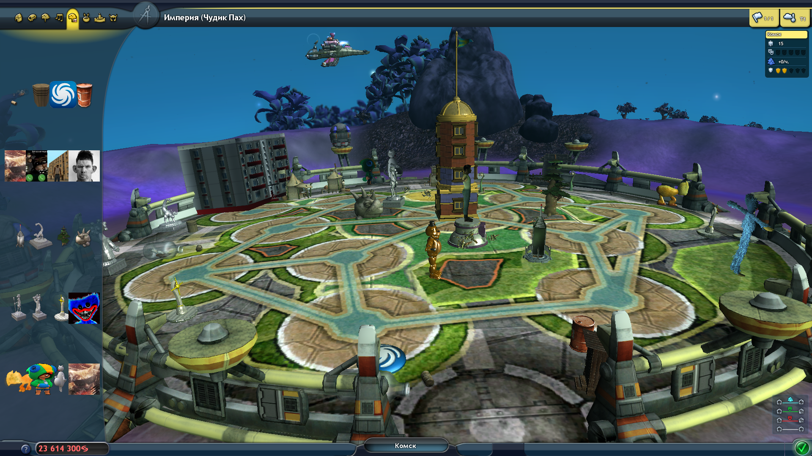
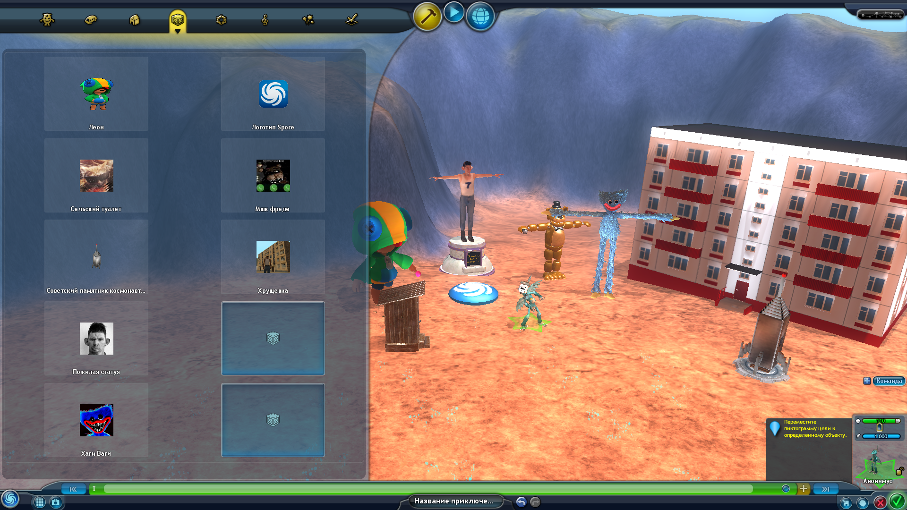

# RedGrox city objects

Мод на новые декорации для городов.

___

## Бонус к моду

В качестве бонуса я добавил эти объекты в редактор приключений.

___

## Как установить

Вы можете установить мод с помощью [Spore ModAPI Launcher Kit](http://davoonline.com/sporemodder/rob55rod/ModAPI/Public/index.html) или вручную.
Если вы хотите установить мод вручную, просто закиньте файл **`RedGrox_city_objects.package`** в папку **`DataEP1`** *(точно так же можно сделать с бонусом)*

___

## Создатель

Мод сделал **RedGrox** (Дух Ияхо)

* [Основной канал](https://www.youtube.com/c/ДухИяхо)
* [Второй канал](https://www.youtube.com/c/КрутойДухИяхо2013)
* [Телеграм](https://t.me/SporeRedGroxMods)
* [spore.com](http://www.spore.com/view/myspore/RedGrox)
